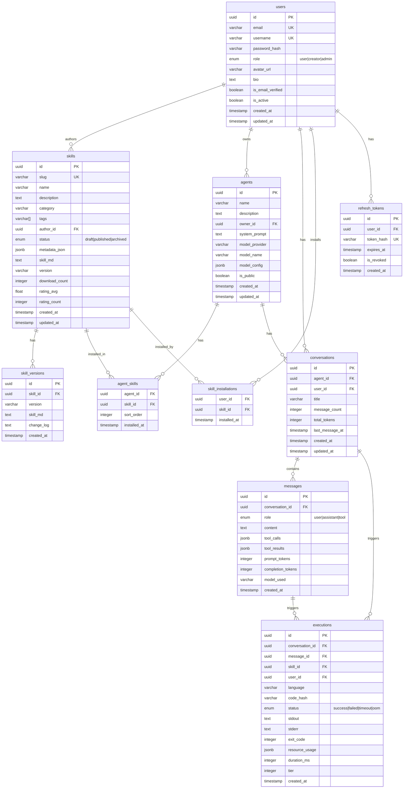

# SkillForge 数据库 Schema 设计

> **数据库**：PostgreSQL 16 + pgvector 扩展
> **ORM**：TypeORM（NestJS）
> **迁移**：TypeORM Migrations

---

## 实体关系图



---

## 详细字段说明

### users

| 字段 | 类型 | 约束 | 说明 |
|------|------|------|------|
| id | UUID | PK, DEFAULT gen_random_uuid() | 主键 |
| email | VARCHAR(255) | NOT NULL, UNIQUE | 邮箱（登录用） |
| username | VARCHAR(50) | NOT NULL, UNIQUE | 用户名（URL 友好）|
| password_hash | VARCHAR(255) | NOT NULL | bcrypt 哈希 |
| role | ENUM | NOT NULL, DEFAULT 'user' | user/creator/admin |
| avatar_url | VARCHAR(500) | NULL | 头像 URL |
| bio | TEXT | NULL | 个人简介 |
| is_email_verified | BOOLEAN | NOT NULL, DEFAULT false | 邮箱验证状态 |
| is_active | BOOLEAN | NOT NULL, DEFAULT true | 账户状态 |
| created_at | TIMESTAMPTZ | NOT NULL, DEFAULT NOW() | |
| updated_at | TIMESTAMPTZ | NOT NULL, DEFAULT NOW() | |

**索引**：`email`（UNIQUE）、`username`（UNIQUE）

---

### refresh_tokens

| 字段 | 类型 | 说明 |
|------|------|------|
| id | UUID PK | |
| user_id | UUID FK→users | |
| token_hash | VARCHAR(255) UNIQUE | SHA-256 哈希存储 |
| expires_at | TIMESTAMPTZ | 过期时间 |
| is_revoked | BOOLEAN | 是否已撤销 |
| created_at | TIMESTAMPTZ | |

---

### skills

| 字段 | 类型 | 说明 |
|------|------|------|
| id | UUID PK | |
| slug | VARCHAR(100) UNIQUE | URL 友好标识符 |
| name | VARCHAR(200) NOT NULL | Skill 名称 |
| description | TEXT NOT NULL | 简短描述（用于 LLM 路由）|
| category | VARCHAR(50) NOT NULL | 预定义分类 |
| tags | VARCHAR(50)[] | 标签数组 |
| author_id | UUID FK→users | 创作者 |
| status | ENUM | draft/published/archived |
| metadata_json | JSONB | L1 元数据（完整 YAML Front Matter）|
| skill_md | TEXT | 完整 SKILL.md 内容（L2）|
| version | VARCHAR(20) | 当前版本 SemVer |
| download_count | INTEGER DEFAULT 0 | 安装次数 |
| rating_avg | FLOAT DEFAULT 0 | 平均评分 |
| rating_count | INTEGER DEFAULT 0 | 评分人数 |
| created_at | TIMESTAMPTZ | |
| updated_at | TIMESTAMPTZ | |

**索引**：
- `slug`（UNIQUE）
- `author_id`（普通索引）
- `category`, `status`（复合索引，用于商店过滤）
- `tags` GIN 索引（数组搜索）
- `metadata_json` GIN 索引（JSONB 查询）
- `name`, `description` tsvector GIN 索引（全文搜索）

---

### agents

| 字段 | 类型 | 说明 |
|------|------|------|
| id | UUID PK | |
| name | VARCHAR(200) | Agent 名称 |
| description | TEXT | 描述 |
| owner_id | UUID FK→users | 所有者 |
| system_prompt | TEXT | 基础系统 Prompt |
| model_provider | VARCHAR(50) | openai/anthropic/groq 等 |
| model_name | VARCHAR(100) | gpt-4o/claude-3-5-sonnet 等 |
| model_config | JSONB | temperature, max_tokens 等 |
| is_public | BOOLEAN DEFAULT false | 是否公开 |
| created_at | TIMESTAMPTZ | |
| updated_at | TIMESTAMPTZ | |

---

### conversations

| 字段 | 类型 | 说明 |
|------|------|------|
| id | UUID PK | |
| agent_id | UUID FK→agents | 关联的 Agent |
| user_id | UUID FK→users | 发起对话的用户 |
| title | VARCHAR(200) | 对话标题（自动生成）|
| message_count | INTEGER DEFAULT 0 | 消息数 |
| total_tokens | INTEGER DEFAULT 0 | 累计 Token 消耗 |
| last_message_at | TIMESTAMPTZ | 最后消息时间 |
| created_at | TIMESTAMPTZ | |
| updated_at | TIMESTAMPTZ | |

---

### messages

| 字段 | 类型 | 说明 |
|------|------|------|
| id | UUID PK | |
| conversation_id | UUID FK→conversations | |
| role | ENUM | user/assistant/tool |
| content | TEXT | 消息内容 |
| tool_calls | JSONB NULL | LLM tool_call 请求 |
| tool_results | JSONB NULL | 工具执行结果 |
| prompt_tokens | INTEGER | 输入 Token 数 |
| completion_tokens | INTEGER | 输出 Token 数 |
| model_used | VARCHAR(100) | 使用的模型 |
| created_at | TIMESTAMPTZ | |

**索引**：`conversation_id` + `created_at`（复合，用于分页）

---

### executions

| 字段 | 类型 | 说明 |
|------|------|------|
| id | UUID PK | |
| conversation_id | UUID FK | |
| message_id | UUID FK | |
| skill_id | UUID FK | |
| user_id | UUID FK | |
| language | VARCHAR(20) | python/javascript |
| code_hash | VARCHAR(64) | SHA-256（不存明文）|
| status | ENUM | success/failed/timeout/oom |
| stdout | TEXT | 标准输出（截断至 100KB）|
| stderr | TEXT | 标准错误（截断至 10KB）|
| exit_code | INTEGER | |
| resource_usage | JSONB | CPU/内存/耗时等 |
| duration_ms | INTEGER | 执行耗时 |
| tier | SMALLINT | 安全等级 1/2/3 |
| created_at | TIMESTAMPTZ | |

---

## pgvector 扩展

未来版本（v0.5）将添加向量搜索支持：

```sql
-- Skill 向量嵌入（用于语义搜索）
CREATE TABLE skill_embeddings (
    skill_id UUID PRIMARY KEY REFERENCES skills(id) ON DELETE CASCADE,
    embedding vector(1536),  -- OpenAI text-embedding-3-small
    created_at TIMESTAMPTZ DEFAULT NOW()
);

CREATE INDEX ON skill_embeddings USING ivfflat (embedding vector_cosine_ops);
```

---

## TypeORM Migration 策略

1. 不使用 `synchronize: true`（生产环境禁止）
2. 所有 Schema 变更通过 Migration 文件管理
3. Migration 文件命名：`{timestamp}-{description}.ts`
4. 每个 PR 包含对应的 Migration 文件
