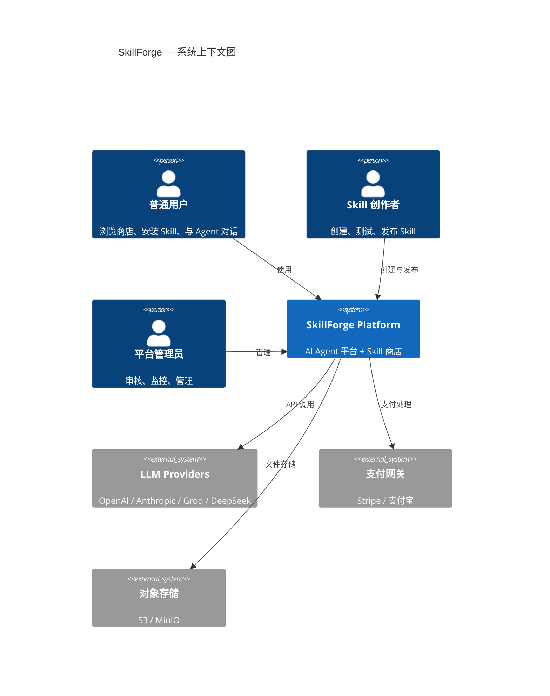
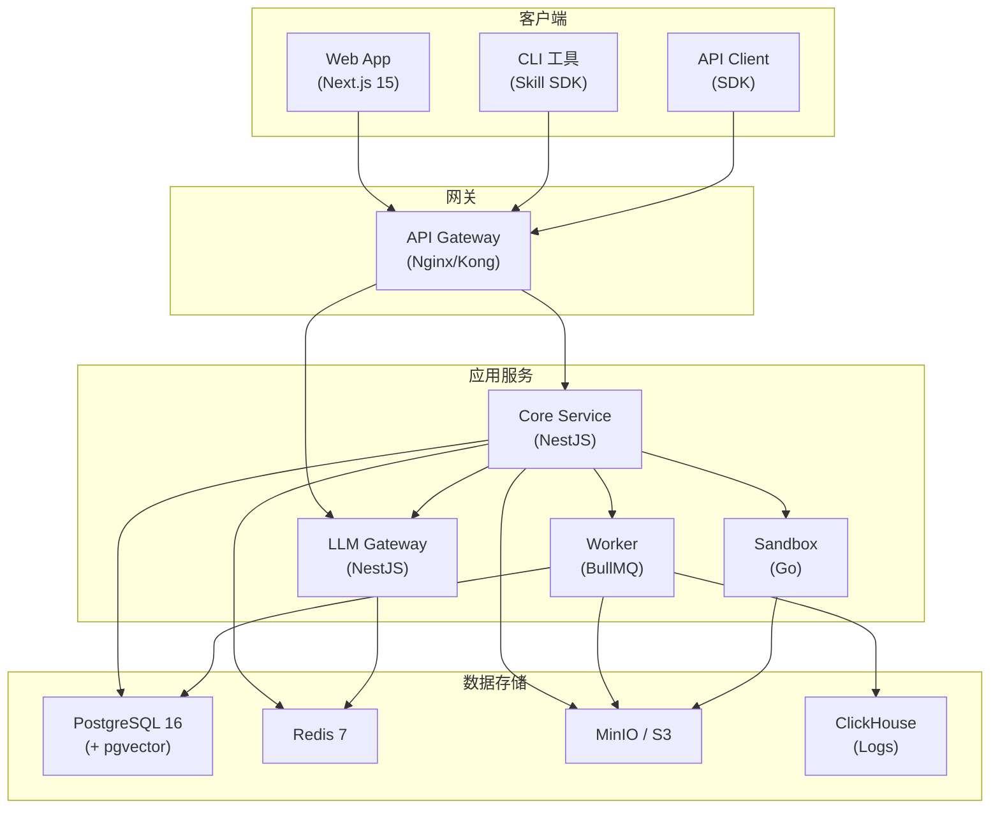
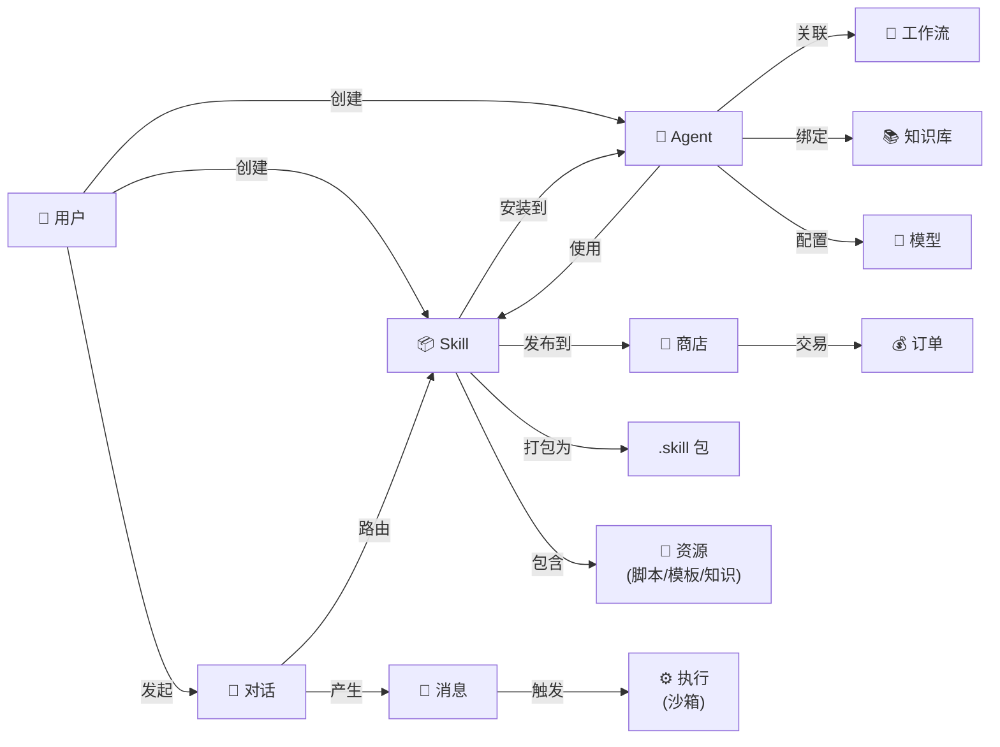
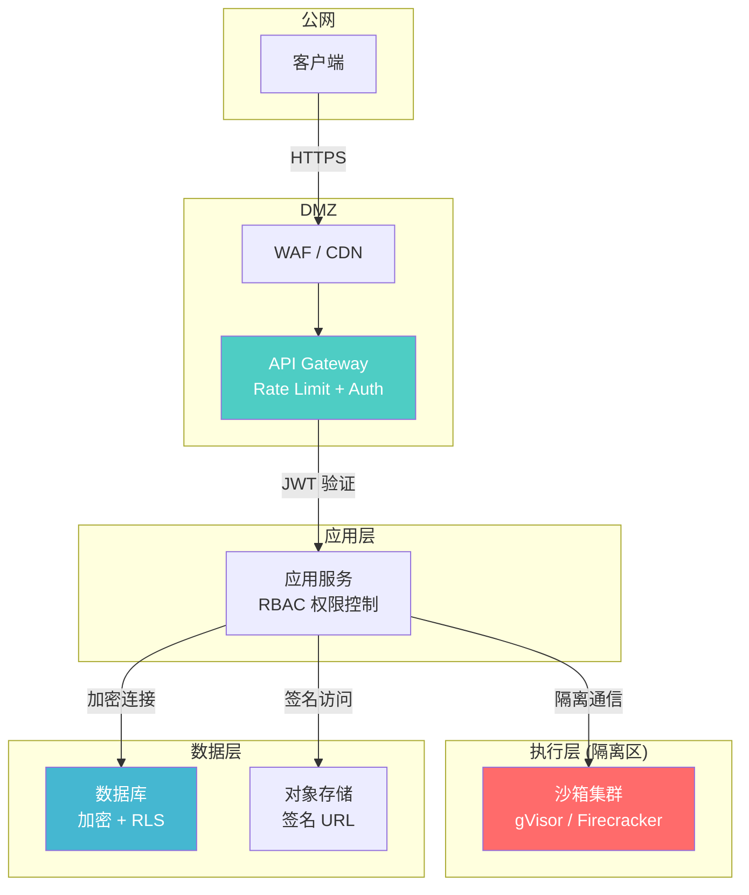

# SkillForge 架构总览

## 系统上下文



## 服务拓扑



## 核心概念关系



## 请求处理流程

```
1. 用户发送消息
   ↓
2. API Gateway 路由 → Core Service
   ↓
3. 认证 & 权限验证
   ↓
4. Skill Router (L1: 加载元数据, ~150 tokens/skill)
   ↓
5. LLM 路由推理 (轻量模型: GPT-4o-mini)
   → 判断哪个 Skill 与用户意图相关
   ↓
6. Skill Loader (L2: 加载完整 SKILL.md, ~2500 tokens)
   ↓
7. 组装完整 Prompt = System + Skill 指令 + 对话历史 + 用户消息
   ↓
8. LLM 推理 (标准模型: GPT-4o)
   → 返回回答 或 tool_call 决策
   ↓
9. [如有 tool_call] Skill Loader (L3: 加载脚本/模板)
   → Sandbox 执行代码
   → 返回结果
   ↓
10. LLM 合成最终回答
   ↓
11. SSE 流式返回给用户
   ↓
12. 保存消息 + 执行日志 + Token 统计
```

## 安全架构



## 数据流总览

| 数据流 | 协议 | 说明 |
|--------|------|------|
| 前端 ↔ API | HTTPS + SSE | REST API + 流式响应 |
| API ↔ LLM | HTTPS | 模型 API 调用 |
| API ↔ DB | TCP (加密) | PostgreSQL 协议 |
| API ↔ Redis | TCP | 缓存读写 |
| API ↔ Sandbox | HTTP/gRPC | 代码执行请求 |
| API ↔ S3 | HTTPS | 文件上传/下载 |
| Worker ↔ Queue | Redis Protocol | 任务分发 |
