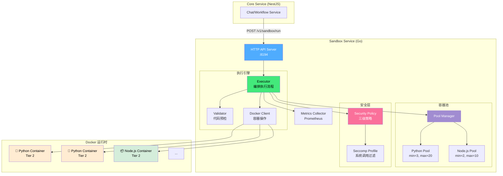
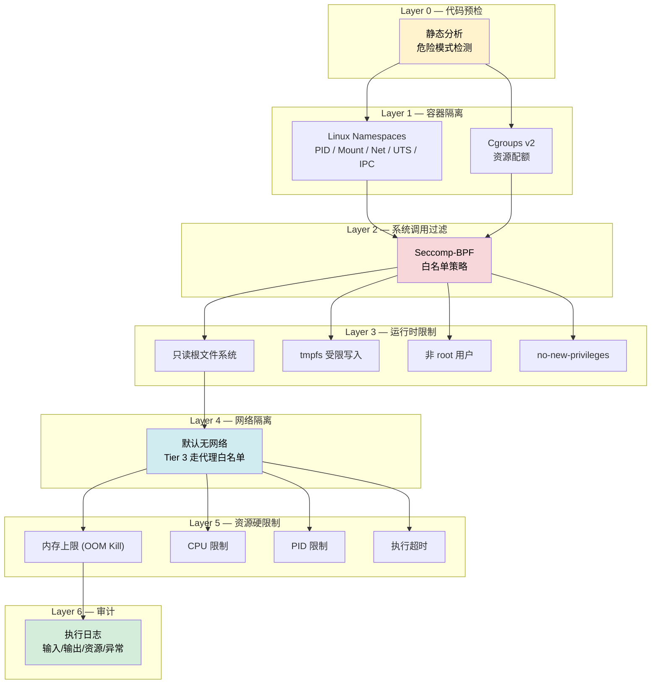
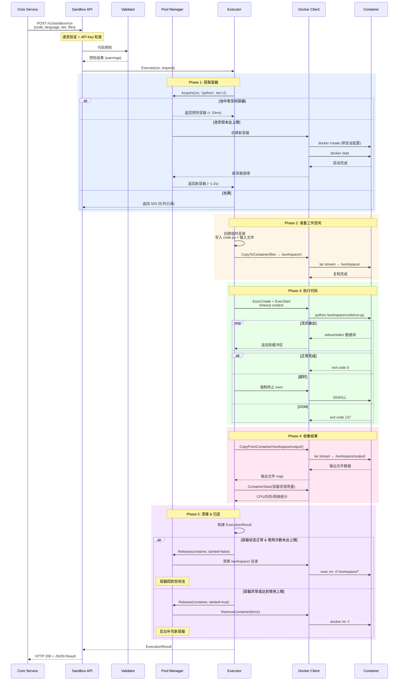
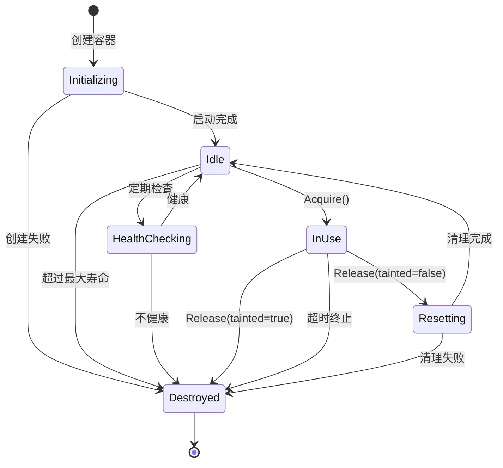

# SkillForge 沙箱执行模块 — 详细技术设计

> **模块名称**: Sandbox Service  
> **语言**: Go 1.22+  
> **职责**: 在安全隔离环境中执行用户提交的代码（Python / JavaScript）  
> **通信**: HTTP API（被 Core Service 内部调用）  
> **部署**: 独立 Docker 容器，与主业务服务隔离

---

## 目录

1. [设计目标与约束](#1-设计目标与约束)
2. [整体架构](#2-整体架构)
3. [安全模型](#3-安全模型)
4. [执行生命周期](#4-执行生命周期)
5. [容器池管理](#5-容器池管理)
6. [API 契约](#6-api-契约)
7. [运行时环境](#7-运行时环境)
8. [资源管理与监控](#8-资源管理与监控)
9. [部署架构](#9-部署架构)
10. [故障处理与恢复](#10-故障处理与恢复)

---

## 1. 设计目标与约束

### 1.1 核心目标

| 目标 | 量化指标 |
|------|---------|
| **安全性** | 零容器逃逸、零跨租户数据泄露 |
| **低延迟** | 冷启动 < 2s，热启动 < 200ms |
| **高吞吐** | 单节点支持 50+ 并发执行 |
| **可观测** | 每次执行完整审计日志、资源用量追踪 |
| **可靠性** | 执行超时 100% 自动终止、容器泄漏 0% |

### 1.2 设计约束

| 约束 | 说明 |
|------|------|
| **假设所有代码都是恶意的** | 防御性设计，不信任任何用户输入 |
| **无状态执行** | 每次执行独立，不保留前次状态 |
| **仅内部调用** | 不暴露公网，仅被 Core Service 通过内网调用 |
| **Linux 专用** | 依赖 Linux 内核特性（seccomp, namespaces, cgroups） |
| **Docker 运行时** | MVP 阶段基于 Docker；后期可替换为 gVisor/Firecracker |

### 1.3 为什么用 Go

| 维度 | Go 优势 |
|------|--------|
| **并发模型** | goroutine 天然适合管理容器池（预热、健康检查、并行执行追踪） |
| **安全边界独立性** | 宿主服务与被执行代码使用不同技术栈，增加攻击难度 |
| **单二进制部署** | 编译为静态二进制，无运行时依赖，极简容器镜像 |
| **Docker SDK** | Docker 本身是 Go 写的，Go SDK 是第一公民，完整类型安全 |
| **资源占用** | 内存占用为 Python 同等服务的 1/5 ~ 1/10 |
| **类型安全** | 安全策略、资源限制等关键配置在编译期检查 |

---

## 2. 整体架构

### 2.1 组件拓扑



### 2.2 代码结构

```
services/sandbox/
├── cmd/
│   └── sandbox/
│       └── main.go                 # 入口：配置加载、池初始化、HTTP 启动
├── internal/
│   ├── config/
│   │   └── config.go               # 配置结构体 + YAML/ENV 加载
│   ├── api/
│   │   ├── router.go               # Chi 路由定义
│   │   ├── handler.go              # 请求处理器
│   │   └── middleware.go           # 认证、日志、panic 恢复
│   ├── executor/
│   │   ├── executor.go             # 核心执行编排逻辑
│   │   ├── docker.go               # Docker SDK 封装
│   │   └── result.go               # 执行请求/结果类型定义
│   ├── pool/
│   │   ├── pool.go                 # 容器池管理器
│   │   └── container.go            # 容器生命周期状态机
│   ├── security/
│   │   ├── policy.go               # 三级安全策略定义
│   │   ├── seccomp.go              # Seccomp 配置生成
│   │   └── validator.go            # 代码静态预检
│   └── runtime/
│       ├── python.go               # Python 运行时配置
│       └── javascript.go           # JavaScript 运行时配置
├── docker/
│   ├── Dockerfile                  # 沙箱服务自身镜像
│   ├── python/
│   │   └── Dockerfile              # Python 执行环境镜像
│   └── node/
│       └── Dockerfile              # Node.js 执行环境镜像
├── configs/
│   ├── config.yaml                 # 默认配置文件
│   └── seccomp/
│       ├── tier1_python.json       # Tier 1 Python seccomp
│       ├── tier2_python.json       # Tier 2 Python seccomp
│       └── tier2_node.json         # Tier 2 Node.js seccomp
├── go.mod
└── go.sum
```

---

## 3. 安全模型

### 3.1 纵深防御架构



### 3.2 三级安全策略详细对比

```
┌─────────────────────────────────────────────────────────────────────────┐
│                        安全策略三级体系                                   │
├─────────────┬──────────────────┬──────────────────┬────────────────────┤
│   维度       │  Tier 1 (基础)    │  Tier 2 (标准)    │  Tier 3 (高级)     │
├─────────────┼──────────────────┼──────────────────┼────────────────────┤
│ 适用场景     │ 数学计算          │ 数据分析          │ 需网络/长时间运行    │
│             │ 数据转换          │ 图表生成          │ 外部 API 调用       │
│             │ 字符串处理        │ 文件处理          │ 复杂数据管道        │
├─────────────┼──────────────────┼──────────────────┼────────────────────┤
│ 隔离方式     │ seccomp+namespace │ Docker+seccomp   │ Docker+seccomp     │
│             │                  │                  │ (未来: gVisor/FC)   │
├─────────────┼──────────────────┼──────────────────┼────────────────────┤
│ 内存限制     │ 256 MB           │ 512 MB           │ 2 GB               │
│ CPU 限制     │ 1 核             │ 1 核             │ 2 核               │
│ PID 限制     │ 50               │ 100              │ 200                │
│ 执行超时     │ 30 秒            │ 120 秒           │ 1800 秒 (30分)     │
├─────────────┼──────────────────┼──────────────────┼────────────────────┤
│ 网络访问     │ ❌ 完全禁止       │ ❌ 完全禁止       │ ⚠️ 代理白名单       │
│ 文件写入     │ ❌ 无            │ ✅ tmpfs 256MB    │ ✅ tmpfs 1GB       │
│ 文件读取     │ ✅ /workspace 只  │ ✅ /workspace     │ ✅ /workspace       │
│ 包安装       │ ❌ 仅预装        │ ❌ 仅预装         │ ⚠️ 受审核包列表     │
├─────────────┼──────────────────┼──────────────────┼────────────────────┤
│ 预装 Python包│ math, json, re   │ pandas, numpy    │ 全部 Tier 2 +      │
│             │ datetime, csv    │ matplotlib       │ requests, scipy    │
│             │ collections      │ seaborn, openpyxl│ scikit-learn       │
│             │ itertools        │ Pillow, tabulate │ beautifulsoup4     │
├─────────────┼──────────────────┼──────────────────┼────────────────────┤
│ 预装 Node包  │ (内置模块)       │ lodash, dayjs    │ 全部 Tier 2 +      │
│             │                  │ csv-parse        │ axios, cheerio     │
│             │                  │ xlsx             │ sharp              │
├─────────────┼──────────────────┼──────────────────┼────────────────────┤
│ Seccomp策略  │ 极严格           │ 标准             │ 宽松               │
│ 允许syscall  │ ~40 个           │ ~80 个           │ ~120 个            │
├─────────────┼──────────────────┼──────────────────┼────────────────────┤
│ rootfs       │ 只读             │ 只读             │ 只读               │
│ tmpfs 挂载   │ /tmp: 64MB       │ /tmp: 128MB      │ /tmp: 256MB        │
│             │                  │ /workspace: 256MB│ /workspace: 1GB    │
├─────────────┼──────────────────┼──────────────────┼────────────────────┤
│ 容器池预热   │ 5 个             │ 3 个             │ 0 个 (按需创建)     │
│ 容器最大复用 │ 50 次            │ 20 次            │ 1 次 (用后销毁)     │
│ 容器最大寿命 │ 1 小时           │ 30 分钟          │ 不适用             │
└─────────────┴──────────────────┴──────────────────┴────────────────────┘
```

### 3.3 Seccomp 系统调用白名单策略

不同 Tier 对应不同的 seccomp profile。以 Tier 2 Python 为例：

```json
{
  "defaultAction": "SCMP_ACT_ERRNO",
  "defaultErrnoRet": 1,
  "architectures": ["SCMP_ARCH_X86_64", "SCMP_ARCH_AARCH64"],
  "syscalls": [
    {
      "names": [
        "read", "write", "close", "fstat", "lseek", "mmap", "mprotect",
        "munmap", "brk", "ioctl", "access", "pipe", "select", "mremap",
        "msync", "madvise", "shmget", "shmat", "shmctl", "dup", "dup2",
        "pause", "nanosleep", "getitimer", "alarm", "setitimer", "getpid",
        "socket", "connect", "sendto", "recvfrom", "shutdown", "bind",
        "listen", "getsockname", "getpeername", "socketpair", "setsockopt",
        "getsockopt", "clone", "fork", "execve", "exit", "wait4",
        "kill", "uname", "fcntl", "flock", "fsync", "fdatasync",
        "truncate", "ftruncate", "getdents", "getcwd", "chdir",
        "rename", "mkdir", "rmdir", "creat", "link", "unlink",
        "symlink", "readlink", "chmod", "fchmod", "chown", "fchown",
        "lchown", "umask", "gettimeofday", "getrlimit", "getrusage",
        "sysinfo", "times", "getuid", "getgid", "geteuid", "getegid",
        "getppid", "getpgrp", "setsid", "setreuid", "setregid",
        "getgroups", "setgroups", "setresuid", "getresuid", "setresgid",
        "getresgid", "sigaltstack", "rt_sigaction", "rt_sigprocmask",
        "rt_sigreturn", "rt_sigsuspend", "pread64", "pwrite64",
        "readv", "writev", "arch_prctl", "futex", "set_tid_address",
        "set_robust_list", "exit_group", "epoll_create", "epoll_ctl",
        "epoll_wait", "openat", "newfstatat", "readlinkat", "fchownat",
        "futimesat", "unlinkat", "renameat", "fchmodat", "faccessat",
        "pselect6", "ppoll", "epoll_pwait", "eventfd2", "dup3",
        "pipe2", "getrandom", "memfd_create", "statx", "rseq",
        "clone3", "close_range", "epoll_create1"
      ],
      "action": "SCMP_ACT_ALLOW"
    }
  ]
}
```

> **设计要点**：采用白名单（默认拒绝）而非黑名单。Tier 1 去掉 `socket`/`connect` 等网络相关调用；Tier 3 额外允许 `sendmsg`/`recvmsg` 等。

### 3.4 代码预检（静态分析）

预检是 **Warning 级别** 的辅助安全层（不作为唯一安全手段），用于提前发现明显危险模式：

```
Python 危险模式:
├── os.system(...)           → 警告: shell 命令执行
├── subprocess.*             → 警告: 子进程创建
├── __import__('os')         → 警告: 动态导入 os 模块
├── eval(...)                → 警告: 动态代码执行
├── exec(...)                → 警告: 动态代码执行 (需区分 pandas exec)
├── open('/etc/...')         → 警告: 访问系统文件
├── socket.socket(...)       → 警告: 网络访问
├── ctypes.*                 → 警告: FFI 调用
├── importlib.*              → 警告: 动态模块加载
└── signal.*                 → 警告: 信号处理

JavaScript 危险模式:
├── child_process.*          → 警告: 子进程
├── require('fs').unlink.*   → 警告: 文件删除
├── process.exit(...)        → 警告: 进程退出
├── eval(...)                → 警告: 动态执行
├── Function(...)            → 警告: 动态函数构造
├── require('net')           → 警告: 网络访问
├── require('dgram')         → 警告: UDP 网络
├── require('cluster')       → 警告: 集群
└── process.env              → 警告: 环境变量访问
```

---

## 4. 执行生命周期

### 4.1 完整执行时序



### 4.2 容器内部执行流程

```
容器启动时 (预热阶段):
┌────────────────────────────────────────────┐
│ Docker Container (skillforge/sandbox-python)│
│                                            │
│  User: sandbox (uid=65534)                 │
│  Rootfs: read-only                         │
│  Mounts:                                   │
│    /tmp          → tmpfs (128MB)           │
│    /workspace    → tmpfs (256MB)           │
│  Network: none                             │
│  Seccomp: tier2_python.json                │
│                                            │
│  预装 Python 3.12 + packages              │
│  等待 exec 命令...                         │
└────────────────────────────────────────────┘

代码执行时 (docker exec):
┌────────────────────────────────────────────┐
│ /workspace/                                │
│ ├── code/                                  │
│ │   ├── run.py        ← 用户代码           │
│ │   └── wrapper.py    ← 执行包装器         │
│ ├── input/                                 │
│ │   ├── data.csv      ← 用户上传文件       │
│ │   └── config.json   ← 环境配置          │
│ └── output/                                │
│     ├── result.json   → 结构化输出         │
│     ├── chart.png     → 生成的图表         │
│     └── report.md     → 生成的报告         │
│                                            │
│ 执行命令:                                   │
│ python /workspace/code/wrapper.py          │
│                                            │
│ wrapper.py 逻辑:                            │
│ 1. 设置 sys.path                           │
│ 2. 重定向 stdout/stderr                    │
│ 3. import 并执行 run.py                    │
│ 4. 捕获异常 → 写入 result.json            │
│ 5. 收集 output/ 目录文件列表              │
└────────────────────────────────────────────┘
```

### 4.3 执行包装器（wrapper.py）

```python
#!/usr/bin/env python3
"""
SkillForge Sandbox Execution Wrapper
安全执行用户代码并收集结果
"""
import sys
import json
import time
import traceback
import os
import resource

# === 安全限制 ===
# 限制可导入的模块（Tier 级别由外部 seccomp 控制）
WORKSPACE = "/workspace"
CODE_DIR = os.path.join(WORKSPACE, "code")
INPUT_DIR = os.path.join(WORKSPACE, "input")
OUTPUT_DIR = os.path.join(WORKSPACE, "output")
RESULT_FILE = os.path.join(OUTPUT_DIR, "_result.json")

def setup():
    """初始化执行环境"""
    os.makedirs(OUTPUT_DIR, exist_ok=True)
    sys.path.insert(0, CODE_DIR)
    sys.path.insert(0, INPUT_DIR)
    # 切换工作目录到 input（方便用户代码直接读取文件）
    os.chdir(INPUT_DIR)

def execute():
    """执行用户代码"""
    start_time = time.monotonic()
    result = {
        "status": "success",
        "stdout": "",
        "stderr": "",
        "error": None,
        "output_files": [],
        "duration_ms": 0,
        "memory_peak_kb": 0,
    }

    # 捕获 stdout/stderr
    from io import StringIO
    captured_stdout = StringIO()
    captured_stderr = StringIO()
    old_stdout, old_stderr = sys.stdout, sys.stderr
    sys.stdout = captured_stdout
    sys.stderr = captured_stderr

    try:
        # 动态导入并执行用户代码
        import importlib
        user_module = importlib.import_module("run")

        # 如果用户模块有 main() 函数，调用它
        if hasattr(user_module, "main"):
            user_module.main()

    except SystemExit as e:
        result["status"] = "error"
        result["error"] = f"SystemExit: {e.code}"
    except Exception as e:
        result["status"] = "error"
        result["error"] = f"{type(e).__name__}: {str(e)}"
        result["stderr"] += traceback.format_exc()
    finally:
        sys.stdout = old_stdout
        sys.stderr = old_stderr

    # 收集结果
    result["stdout"] = captured_stdout.getvalue()[:1_000_000]  # 限 1MB
    result["stderr"] += captured_stderr.getvalue()[:100_000]   # 限 100KB
    result["duration_ms"] = int((time.monotonic() - start_time) * 1000)

    # 收集资源使用
    usage = resource.getrusage(resource.RUSAGE_CHILDREN)
    result["memory_peak_kb"] = usage.ru_maxrss

    # 收集输出文件
    if os.path.exists(OUTPUT_DIR):
        for f in os.listdir(OUTPUT_DIR):
            if f.startswith("_"):  # 跳过系统文件
                continue
            filepath = os.path.join(OUTPUT_DIR, f)
            if os.path.isfile(filepath):
                size = os.path.getsize(filepath)
                if size <= 10_000_000:  # 单文件限 10MB
                    result["output_files"].append({
                        "name": f,
                        "size": size,
                        "path": filepath,
                    })

    # 写入结果
    with open(RESULT_FILE, "w") as fp:
        json.dump(result, fp, ensure_ascii=False)

    # 同时输出到 stdout 供 docker exec 捕获
    print(json.dumps(result, ensure_ascii=False))

if __name__ == "__main__":
    setup()
    execute()
```

---

## 5. 容器池管理

### 5.1 池状态机



### 5.2 池管理算法

```
Pool Manager 核心循环:
┌──────────────────────────────────────────────────────────────┐
│ 每 5 秒执行一次 reconcile():                                 │
│                                                              │
│ 1. 统计各语言池: idle_count, busy_count, total_count         │
│                                                              │
│ 2. 补充不足:                                                 │
│    for each language:                                        │
│      deficit = min_idle - idle_count                         │
│      if deficit > 0 && total_count < max_total:             │
│        spawn min(deficit, max_total - total_count) containers│
│                                                              │
│ 3. 清理过期:                                                 │
│    for each idle container:                                  │
│      if container.age > max_age:                            │
│        destroy(container)                                    │
│      if container.use_count > max_uses:                     │
│        destroy(container)                                    │
│                                                              │
│ 4. 健康检查 (每 30 秒):                                      │
│    for each idle container:                                  │
│      if !healthCheck(container):                            │
│        destroy(container)                                    │
│                                                              │
│ 5. 缩容 (空闲过多时):                                       │
│    excess = idle_count - min_idle * 2                        │
│    if excess > 0:                                           │
│      destroy oldest excess containers                        │
└──────────────────────────────────────────────────────────────┘

Acquire 算法:
┌──────────────────────────────────────────────────────────────┐
│ func Acquire(ctx, language, tier):                           │
│   1. 尝试从空闲池取: idle_pool[language].tryGet()           │
│      → 成功: 标记 InUse, 返回                               │
│                                                              │
│   2. 池未满? 创建新容器:                                     │
│      if total_count < max_total:                            │
│        container = createContainer(language, tier)            │
│        → 成功: 标记 InUse, 返回                              │
│                                                              │
│   3. 等待释放 (带超时):                                      │
│      select {                                                │
│        case c := <-idle_pool[language]:                      │
│          return c                                            │
│        case <-ctx.Done():                                    │
│          return ErrPoolExhausted                             │
│        case <-time.After(acquire_timeout):                   │
│          return ErrAcquireTimeout                            │
│      }                                                       │
└──────────────────────────────────────────────────────────────┘
```

### 5.3 池配置参数

| 参数 | Python 池 | Node.js 池 | 说明 |
|------|----------|-----------|------|
| `min_idle` | 3 | 2 | 最小空闲容器数 |
| `max_total` | 20 | 10 | 最大容器总数 |
| `max_uses` | 20 | 20 | 单容器最大使用次数 |
| `max_age` | 30min | 30min | 单容器最大存活时间 |
| `acquire_timeout` | 10s | 10s | 获取容器超时 |
| `health_check_interval` | 30s | 30s | 健康检查间隔 |
| `reconcile_interval` | 5s | 5s | 池调谐间隔 |

---

## 6. API 契约

### 6.1 POST /v1/sandbox/run — 执行代码

**请求**

```http
POST /v1/sandbox/run HTTP/1.1
Host: sandbox:8194
Authorization: Bearer sk-sandbox-xxx
Content-Type: application/json

{
  "execution_id": "550e8400-e29b-41d4-a716-446655440000",
  "language": "python",
  "code": "import pandas as pd\ndf = pd.read_csv('data.csv')\nprint(df.describe())\ndf.to_csv('/workspace/output/summary.csv')",
  "files": {
    "data.csv": "bmFtZSxhZ2Usc2NvcmUKQWxpY2UsMjUsODUKQm9iLDMwLDkwCg=="
  },
  "environment": {
    "ANALYSIS_TYPE": "descriptive"
  },
  "tier": 2,
  "timeout_seconds": 120
}
```

| 字段 | 类型 | 必填 | 说明 |
|------|------|------|------|
| `execution_id` | string(UUID) | 是 | 幂等执行 ID |
| `language` | string | 是 | `python` 或 `javascript` |
| `code` | string | 是 | 要执行的代码（UTF-8, 最大 1MB） |
| `files` | map[string]string | 否 | 输入文件（文件名 → Base64 内容），总大小 ≤ 50MB |
| `environment` | map[string]string | 否 | 注入的环境变量（不包含敏感信息） |
| `tier` | int | 否 | 安全等级 1/2/3，默认 2 |
| `timeout_seconds` | int | 否 | 执行超时（覆盖 Tier 默认值） |

**成功响应 (200)**

```json
{
  "execution_id": "550e8400-e29b-41d4-a716-446655440000",
  "status": "success",
  "exit_code": 0,
  "stdout": "              age      score\ncount   2.000000   2.000000\nmean   27.500000  87.500000\n...",
  "stderr": "",
  "output_files": {
    "summary.csv": "bmFtZSxhZ2Usc2NvcmUK..."
  },
  "warnings": [
    "Code contains potentially dangerous pattern: open() with absolute path"
  ],
  "resource_usage": {
    "cpu_time_ms": 1523,
    "memory_peak_bytes": 104857600,
    "duration_ms": 2341,
    "network_rx_bytes": 0,
    "network_tx_bytes": 0
  },
  "error": null,
  "metadata": {
    "container_id": "abc123",
    "tier": 2,
    "language": "python",
    "pool_wait_ms": 5,
    "image": "skillforge/sandbox-python:3.12"
  }
}
```

**错误响应**

| HTTP 状态码 | 错误类型 | 说明 |
|------------|---------|------|
| 400 | `INVALID_REQUEST` | 请求参数错误 |
| 401 | `UNAUTHORIZED` | API Key 无效 |
| 408 | `EXECUTION_TIMEOUT` | 执行超时 |
| 413 | `PAYLOAD_TOO_LARGE` | 代码或文件超过大小限制 |
| 429 | `RATE_LIMIT_EXCEEDED` | 请求频率超限 |
| 503 | `POOL_EXHAUSTED` | 容器池已满，无可用容器 |
| 500 | `INTERNAL_ERROR` | 内部错误 |

### 6.2 GET /v1/sandbox/health

```json
{
  "status": "healthy",
  "uptime_seconds": 86400,
  "version": "0.1.0",
  "docker": {
    "connected": true,
    "version": "26.1.0"
  },
  "pool": {
    "python": { "idle": 3, "busy": 2, "total": 5 },
    "javascript": { "idle": 2, "busy": 0, "total": 2 }
  }
}
```

### 6.3 GET /v1/sandbox/metrics

返回 Prometheus 格式指标：

```
# HELP sandbox_executions_total Total number of code executions
# TYPE sandbox_executions_total counter
sandbox_executions_total{language="python",tier="2",status="success"} 1523
sandbox_executions_total{language="python",tier="2",status="timeout"} 12
sandbox_executions_total{language="python",tier="2",status="error"} 45

# HELP sandbox_execution_duration_ms Execution duration in milliseconds
# TYPE sandbox_execution_duration_ms histogram
sandbox_execution_duration_ms_bucket{language="python",le="100"} 200
sandbox_execution_duration_ms_bucket{language="python",le="1000"} 800
sandbox_execution_duration_ms_bucket{language="python",le="10000"} 1400

# HELP sandbox_pool_containers Container pool status
# TYPE sandbox_pool_containers gauge
sandbox_pool_containers{language="python",state="idle"} 3
sandbox_pool_containers{language="python",state="busy"} 2
sandbox_pool_containers{language="node",state="idle"} 2

# HELP sandbox_pool_acquire_duration_ms Pool acquire latency
# TYPE sandbox_pool_acquire_duration_ms histogram
sandbox_pool_acquire_duration_ms_bucket{le="10"} 900
sandbox_pool_acquire_duration_ms_bucket{le="100"} 1100
sandbox_pool_acquire_duration_ms_bucket{le="2000"} 1200
```

---

## 7. 运行时环境

### 7.1 Python 执行镜像

```dockerfile
# docker/python/Dockerfile
FROM python:3.12-slim AS base

# 安全：创建非特权用户
RUN groupadd -r sandbox && useradd -r -g sandbox -u 65534 -d /home/sandbox sandbox

# Tier 1 基础包（内置，无需安装）
# math, json, re, datetime, csv, collections, itertools, functools

# Tier 2 分析包
RUN pip install --no-cache-dir \
    pandas==2.2.3 \
    numpy==2.1.3 \
    matplotlib==3.9.3 \
    seaborn==0.13.2 \
    openpyxl==3.1.5 \
    Pillow==11.0.0 \
    tabulate==0.9.0 \
    scipy==1.14.1 \
    scikit-learn==1.5.2 \
    && pip cache purge

# 安全：移除 pip，防止运行时安装包
RUN pip uninstall -y pip setuptools wheel 2>/dev/null; \
    rm -rf /usr/local/bin/pip* /usr/local/lib/python*/ensurepip

# 安全：移除编译器和不必要的工具
RUN apt-get purge -y --auto-remove gcc g++ make && \
    rm -rf /var/lib/apt/lists/*

# 创建工作目录结构
RUN mkdir -p /workspace/code /workspace/input /workspace/output && \
    chown -R sandbox:sandbox /workspace

# 复制执行包装器
COPY wrapper.py /opt/sandbox/wrapper.py
RUN chmod 444 /opt/sandbox/wrapper.py

# 设置 matplotlib 使用 Agg 后端（无需 display）
ENV MPLBACKEND=Agg
ENV PYTHONDONTWRITEBYTECODE=1
ENV PYTHONUNBUFFERED=1

USER sandbox
WORKDIR /workspace

# 容器启动后等待 exec 命令（不自动执行任何代码）
CMD ["sleep", "infinity"]
```

### 7.2 Node.js 执行镜像

```dockerfile
# docker/node/Dockerfile
FROM node:20-slim AS base

RUN groupadd -r sandbox && useradd -r -g sandbox -u 65534 -d /home/sandbox sandbox

# 安装 Tier 2 包
RUN mkdir -p /opt/sandbox/node_modules && \
    cd /opt/sandbox && \
    npm install --no-save \
      lodash@4.17.21 \
      dayjs@1.11.13 \
      csv-parse@5.6.0 \
      csv-stringify@6.5.2 \
      xlsx@0.18.5 \
      uuid@10.0.0 \
    && npm cache clean --force

# 安全：移除 npm/yarn
RUN rm -rf /usr/local/bin/npm /usr/local/bin/npx /usr/local/bin/yarn \
    /usr/local/lib/node_modules/npm

# 设置 NODE_PATH 使预装包可用
ENV NODE_PATH=/opt/sandbox/node_modules

RUN mkdir -p /workspace/code /workspace/input /workspace/output && \
    chown -R sandbox:sandbox /workspace

COPY wrapper.js /opt/sandbox/wrapper.js
RUN chmod 444 /opt/sandbox/wrapper.js

USER sandbox
WORKDIR /workspace

CMD ["sleep", "infinity"]
```

---

## 8. 资源管理与监控

### 8.1 资源用量采集

每次执行结束后，从 Docker API 采集容器级资源用量：

```
采集指标:
├── CPU
│   ├── cpu_time_user_ms      用户态 CPU 时间
│   ├── cpu_time_system_ms    内核态 CPU 时间
│   └── cpu_throttled_ms      被限流的 CPU 时间
├── Memory
│   ├── memory_current_bytes  当前内存占用
│   ├── memory_peak_bytes     峰值内存 (max_usage)
│   └── memory_limit_bytes    内存上限
├── I/O
│   ├── io_read_bytes         磁盘读取
│   └── io_write_bytes        磁盘写入
├── Network (Tier 3 only)
│   ├── network_rx_bytes      接收字节
│   └── network_tx_bytes      发送字节
└── Timing
    ├── pool_wait_ms          等待容器时间
    ├── prepare_ms            工作空间准备时间
    ├── execution_ms          代码执行时间
    ├── collect_ms            结果收集时间
    └── total_ms              总耗时
```

### 8.2 告警规则

| 告警 | 条件 | 级别 |
|------|------|------|
| 容器池耗尽 | idle_count == 0 && busy_count == max_total | 🔴 Critical |
| 执行超时率 | timeout_rate > 10% (5 min window) | 🟡 Warning |
| OOM Kill | oom_kill_count > 0 (1 min window) | 🟡 Warning |
| 容器创建失败 | create_error_count > 3 (5 min) | 🔴 Critical |
| 容器泄漏 | total_count > max_total * 1.2 | 🔴 Critical |
| 高延迟 | p99_duration > tier_timeout * 0.8 | 🟡 Warning |
| Docker 连接丢失 | docker_ping_failed | 🔴 Critical |

### 8.3 审计日志

每次执行记录完整审计日志（JSON 格式写入 ClickHouse）：

```json
{
  "execution_id": "550e8400-...",
  "timestamp": "2025-06-16T10:30:00Z",
  "tenant_id": "tenant-uuid",
  "user_id": "user-uuid",
  "skill_id": "skill-uuid",
  "language": "python",
  "tier": 2,
  "code_hash": "sha256:abc123...",
  "code_size_bytes": 1024,
  "input_files_count": 1,
  "input_files_size_bytes": 51200,
  "status": "success",
  "exit_code": 0,
  "output_files_count": 2,
  "output_files_size_bytes": 204800,
  "warnings": ["pattern: open() with absolute path"],
  "resource_usage": { "..." },
  "container_id": "abc123",
  "pool_wait_ms": 5,
  "total_duration_ms": 2341,
  "error": null
}
```

---

## 9. 部署架构

### 9.1 Docker Compose（开发环境）

```yaml
# docker-compose.sandbox.yml
services:
  sandbox:
    build:
      context: ./services/sandbox
      dockerfile: docker/Dockerfile
    ports:
      - "8194:8194"
    volumes:
      - /var/run/docker.sock:/var/run/docker.sock  # 需要访问 Docker
      - ./services/sandbox/configs:/app/configs:ro
    environment:
      - SANDBOX_API_KEY=sk-sandbox-dev-key
      - SANDBOX_LOG_LEVEL=debug
      - SANDBOX_POOL_PYTHON_MIN_IDLE=2
      - SANDBOX_POOL_PYTHON_MAX_TOTAL=5
      - SANDBOX_POOL_NODE_MIN_IDLE=1
      - SANDBOX_POOL_NODE_MAX_TOTAL=3
    depends_on:
      - sandbox-python-builder
      - sandbox-node-builder
    restart: unless-stopped
    deploy:
      resources:
        limits:
          memory: 512M
          cpus: "1.0"

  # 构建执行环境镜像
  sandbox-python-builder:
    build:
      context: ./services/sandbox/docker/python
      dockerfile: Dockerfile
    image: skillforge/sandbox-python:latest
    command: "echo 'Image built successfully'"

  sandbox-node-builder:
    build:
      context: ./services/sandbox/docker/node
      dockerfile: Dockerfile
    image: skillforge/sandbox-node:latest
    command: "echo 'Image built successfully'"
```

### 9.2 生产部署注意事项

```
安全清单 ✅:
├── [ ] Docker Socket 权限: 沙箱服务必须能访问 Docker Socket
│       → 生产环境考虑 Docker Socket Proxy 限制 API 调用范围
├── [ ] 网络隔离: 沙箱服务与执行容器在独立网络
├── [ ] 镜像签名: 执行环境镜像使用 Docker Content Trust 签名
├── [ ] Secret 管理: API Key 通过 K8s Secret 或 Vault 注入
├── [ ] 日志: 不记录用户代码明文（仅记录 hash）
├── [ ] 资源配额: K8s ResourceQuota 限制沙箱 namespace 总资源
├── [ ] Pod Security: 使用 PodSecurityStandard restricted
└── [ ] 容器镜像: 定期扫描漏洞（Trivy/Grype）

性能优化 ⚡:
├── [ ] 镜像预拉取: DaemonSet 确保所有节点有执行环境镜像
├── [ ] 本地存储: 容器 tmpfs 使用节点本地 SSD
├── [ ] 池预热: 服务启动时立即创建 min_idle 容器
├── [ ] 连接池: Docker Client 使用连接池复用 HTTP 连接
└── [ ] GC 调优: Go GC 参数优化 (GOGC=50)
```

---

## 10. 故障处理与恢复

### 10.1 故障场景与应对

| 故障场景 | 检测方式 | 应对策略 | 恢复时间 |
|---------|---------|---------|---------|
| **容器执行超时** | context.WithTimeout | SIGKILL 强制终止 → 销毁容器 → 返回 408 | 即时 |
| **容器 OOM Kill** | exit code 137 检测 | 销毁容器 → 返回错误 + OOM 提示 | 即时 |
| **Docker Daemon 重启** | 健康检查 ping 失败 | 重建 Docker Client → 重新预热容器池 | 10-30s |
| **容器泄漏** | 定期 docker ps 审计 | 强制清理孤儿容器 (带 label 过滤) | 后台自动 |
| **磁盘空间不足** | 定期 df 检查 | 清理未使用镜像 + 停止接收新请求 | 手动 |
| **沙箱服务 Crash** | K8s liveness probe | Pod 自动重启 → 池重新预热 | 30-60s |
| **网络分区** | 调用方超时 | 调用方重试 (幂等 execution_id) | 取决于网络 |

### 10.2 优雅关机流程

```
收到 SIGTERM:
├── 1. 停止接收新请求（关闭 HTTP listener）
├── 2. 等待正在执行的任务完成（最多 30s）
│   └── 超过 30s 未完成的任务标记为 cancelled
├── 3. 销毁所有容器池中的容器
│   ├── 并行发送 docker rm -f
│   └── 等待所有销毁完成（最多 10s）
├── 4. 关闭 Docker Client
├── 5. 刷新指标和日志
└── 6. 退出进程
```

### 10.3 幂等性设计

通过 `execution_id` 实现幂等：

```
收到执行请求 (execution_id = X):
├── 检查内存缓存: 是否有 X 的结果?
│   ├── 有且已完成 → 直接返回缓存结果
│   ├── 有且进行中 → 等待完成 or 返回 202
│   └── 无 → 正常执行
└── 执行完成后缓存结果 (TTL = 5 min)
```

---

## 附录: 演进路线

| 阶段 | 隔离方案 | 适用场景 |
|------|---------|---------|
| **MVP (v0.1)** | Docker + seccomp + read-only rootfs | 单租户、开发验证 |
| **v0.5** | Docker + gVisor (runsc 运行时) | 多租户、标准隔离 |
| **v1.0** | gVisor (Tier 1-2) + Firecracker (Tier 3) | 生产级、硬件隔离 |
| **v2.0** | K8s + Kata Containers / Firecracker + GPU 支持 | 企业级、AI 工作负载 |
